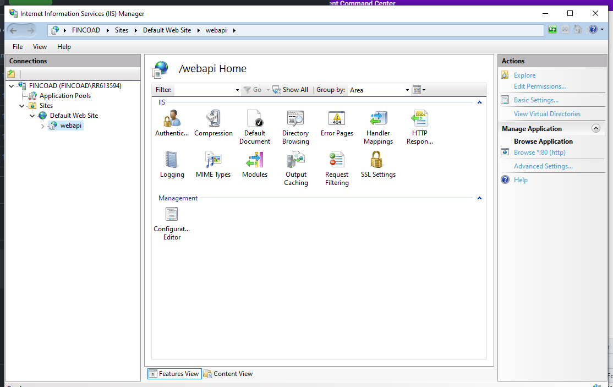
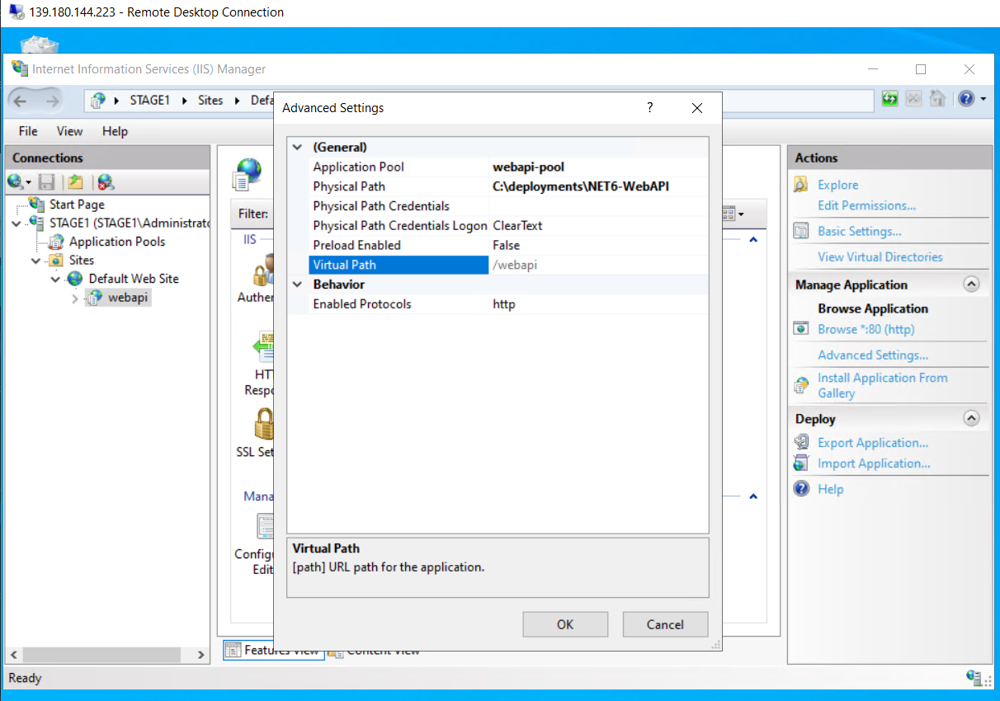
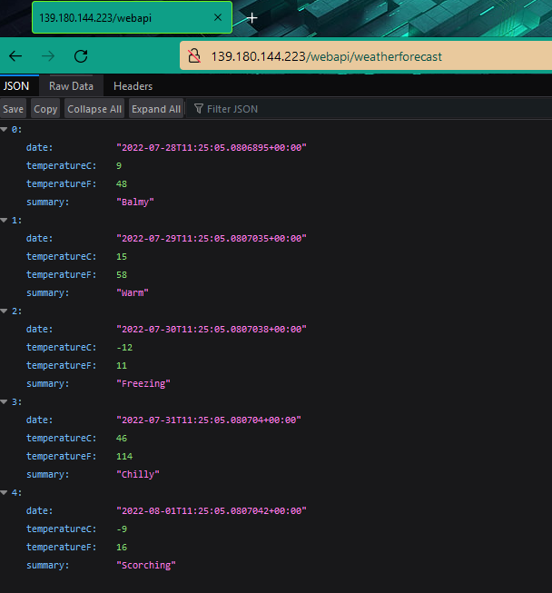

# NET6-WebAPI
+ Create a WebAPI example with .NET6 using Github Actions
+ GitHub Actions:
    - Use `appcmd` and `msdeploy` for deployment the WebAPI on the IIS locally
    - Use Powershell for deployment the Web Application on the IIS

### Required
    + Add self-hosted runner on local machine or windows-latest

#### Deployment Required with MSDeploy
    + Install Web Deployment Tool(using v3) on the server(Using Web Management Service/Web Deploy Handler)

#### Deployment Required with Powershell
    + webadministration module should be imported using powershell
    + Make sure that the GitHub Action Runner agent uses Log on method as “local system account” for the agent service


### Github Actions:
    + Job: Build
    + Job: Deploy_Test
    + Job: Deploy_Stage

### Command Lines
+ Create an Application Pool
    ```
    C:\Windows\System32\inetsrv\appcmd.exe add apppool /name:webapi-pool /managedRuntimeVersion:v4.0 /managedPipelineMode:Integrated
    ```

+ Deploy Application
    ```
    cd "C:/Program Files (x86)/IIS/Microsoft Web Deploy V3/msdeploy.exe"
    .\msdeploy.exe -verb:sync -source:'iisApp="C:\deployments\webapi"' -dest:'iisApp="Default Web Site/webapi"'
    ```

### Check the ISS and API





### Drawback/Issue
+ It throws the error if an application pool exists
+ Couldn't create an application pool with MSDeploy

### TODO:
+ Create a script for checking an existing application pool, if it doesn't exist then create, else nothing
+ Create an web application and set SSL(HTTPS)

### Issues:
#### Fixed: permission with self-hosted runner

+ Github Runner service name
`powershell "(Get-Service actions.runner.*).name"`
==> actions.runner.nhatthai-NET6-WebAPI.FINCOAD

+ Run commands
`pwsh`
`sc config "actions.runner.nhatthai-NET6-WebAPI.FINCOAD" obj="NT AUTHORITY\SYSTEM" type=own`

#### Access is Denied(using Remote Powershell)
```
Starting Deploy WebApp
[139.180.144.223] Connecting to remote server 139.180.144.223 failed with the following error message : Access is
denied. For more information, see the about_Remote_Troubleshooting Help topic.
At C:\actions-runner\_work\_actions\nhatthai\deploy-iis\main\scripts\iss_action.ps1:91 char:1
+ Invoke-Command -ComputerName $server `
+ ~~~~~~~~~~~~~~~~~~~~~~~~~~~~~~~~~~~~~~
    + CategoryInfo          : OpenError: (139.180.144.223:String) [], PSRemotingTransportException
    + FullyQualifiedErrorId : AccessDenied,PSSessionStateBroken
Error: Process completed with exit code 1.
```

```
[139.180.144.223] Connecting to remote server 139.180.144.223 failed with the following error message : WinRM cannot
complete the operation. Verify that the specified computer name is valid, that the computer is accessible over the
network, and that a firewall exception for the WinRM service is enabled and allows access from this computer. By
default, the WinRM firewall exception for public profiles limits access to remote computers within the same local
subnet. For more information, see the about_Remote_Troubleshooting Help topic.
At C:\actions-runner\_work\_actions\nhatthai\deploy-iis\main\scripts\iss_action.ps1:91 char:1
+ Invoke-Command -ComputerName $server -Credential $credential -UseSSL  ...
+ ~~~~~~~~~~~~~~~~~~~~~~~~~~~~~~~~~~~~~~~~~~~~~~~~~~~~~~~~~~~~~~~~~~~~~
    + CategoryInfo          : OpenError: (139.180.144.223:String) [], PSRemotingTransportException
    + FullyQualifiedErrorId : WinRMOperationTimeout,PSSessionStateBroken
```

Make sure the server is listening on Port 5986
netstat -aon
TCP    0.0.0.0:5986           0.0.0.0:0              LISTENING       4

### References
+ [Getting started with AppCmd](https://docs.microsoft.com/en-us/iis/get-started/getting-started-with-iis/getting-started-with-appcmdexe)
+ [AppCmd introduction and examples](https://www.saotn.org/appcmd-introduction-examples/)
+ [Web Deployment Tool Syntax](https://docs.microsoft.com/en-us/previous-versions/windows/it-pro/windows-server-2008-r2-and-2008/dd569106(v=ws.10))
+ [Using the LocalSystem Account as a Service](https://docs.microsoft.com/en-us/windows/win32/ad/the-localsystem-account)
