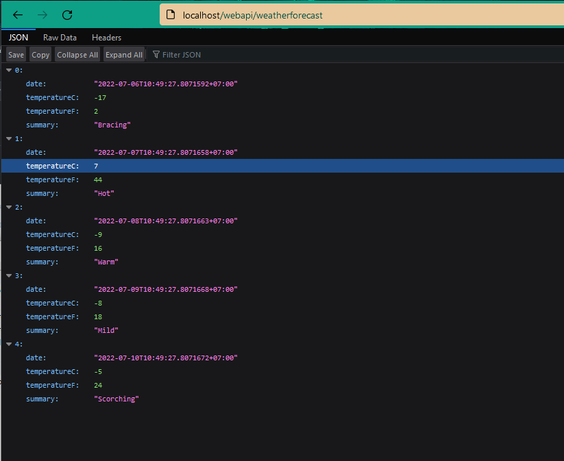

# NET6-WebAPI
+ Create a WebAPI example with .NET6 using Github Actions
+ GitHub Actions: 
    - Use `appcmd` and `msdeploy` for deployment the WebAPI on the IIS locally
    - Use Powershell for deployment the Web Application on the IIS
    
### Required
    + Add self-hosted runner on local machine
    + Install Web Deployment Tool(using v3)

#### Deployment Required with Powershell
    + webadministration module should be imported using powershell
    + Make sure that the GitHub Action Runner agent uses Log on method as “local system account” for the agent service


### Github Actions:
    + Job: Build
    + Job: Deploy_Test

### Command Lines
+ Create an Application Pool
    ```
    C:\Windows\System32\inetsrv\appcmd.exe add apppool /name:webapi-pool /managedRuntimeVersion:v4.0 /managedPipelineMode:Integrated
    ```

+ Deploy Application
    ```
    cd "C:/Program Files (x86)/IIS/Microsoft Web Deploy V3/msdeploy.exe"
    .\msdeploy.exe -verb:sync -source:'iisApp="C:\deployments\webapi"' -dest:'iisApp="Default Web Site/webapi"'
    ```

### Check the ISS and API




### Drawback/Issue
+ It throws the error if an application pool exists

### TODO:
+ Create a script for checking an existing application pool, if it doesn't exist then create, else nothing
+ Create an web application and set SSL(HTTPS)

### Issues:
#### Fixed: permission with self-hosted runner

+ Github Runner service name
`powershell "(Get-Service actions.runner.*).name"`
==> actions.runner.nhatthai-NET6-WebAPI.FINCOAD

+ Run commands
`pwsh`
`sc config "actions.runner.nhatthai-NET6-WebAPI.FINCOAD" obj="NT AUTHORITY\SYSTEM" type=own`

### References
+ [Getting started with AppCmd](https://docs.microsoft.com/en-us/iis/get-started/getting-started-with-iis/getting-started-with-appcmdexe)
+ [AppCmd introduction and examples](https://www.saotn.org/appcmd-introduction-examples/)
+ [Web Deployment Tool Syntax](https://docs.microsoft.com/en-us/previous-versions/windows/it-pro/windows-server-2008-r2-and-2008/dd569106(v=ws.10))
+ [Using the LocalSystem Account as a Service](https://docs.microsoft.com/en-us/windows/win32/ad/the-localsystem-account)
